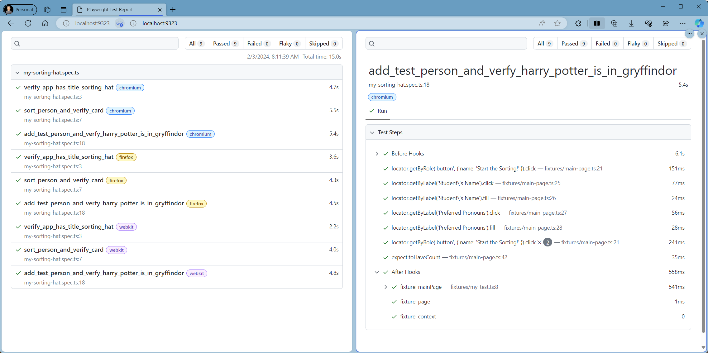
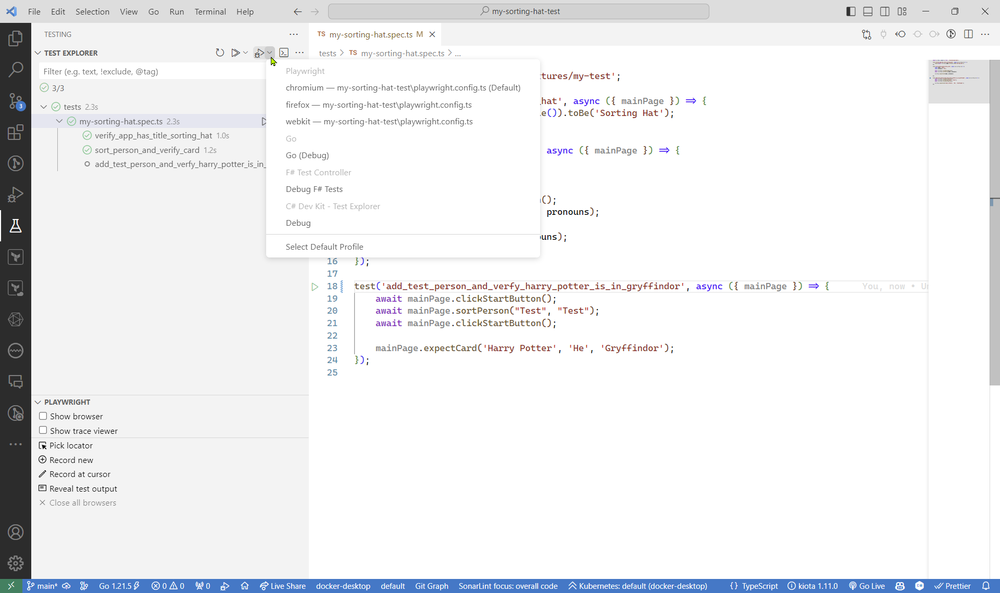
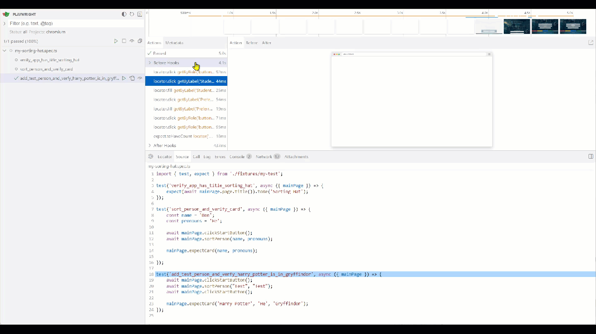

# Playwright Demonstration
This is a quick demonstration of using the Playwright end-to-end testing based on an application created by a [LinkedIn friend.](https://www.linkedin.com/posts/hsmith931_javascript-javascriptdeveloper-javascriptlearning-activity-7159290774906372096-8bKb?utm_source=share&utm_medium=member_desktop) It's been some time since I last worked with Playwright and this was a great opportunity to brush-up and share more of what's possible.

## How to run from command-line
```powershell
# Clone the repository
git clone https://github.com/danielwcarey/playwright-my-sorting-hat.git

# Install the dependencies
npm install

# Install the browsers [if not already installed]
npm run install-playwright

# Run the tests from the command-line
npm run test

# Run the tests from theUI
npm run test:ui

# View the test results
npm run report

# To start making tests
npm start
```

## Test Results

Using Microsoft Edge's split screen feature, we can view the test results and create a quick report for all the tests.




## Testing using Visual Studio Code
If you are using Visual Studio Code, you can run the tests using the test runner.



## Testing using the Test UI

```powershell
npm run test:ui  # npx playwright test --ui
```



## References

- [Playwright](https://playwright.dev/)

- [Playwright Installation](https://playwright.dev/docs/intro)

## Sample scripts from package.json
```json
{
    "dependencies": {
        "npm": "^10.4.0"
    },
    "devDependencies": {
        "@playwright/test": "^1.41.2",
        "@types/node": "^20.11.16"
    },
    "scripts": {
        "start": "npx playwright codegen https://my-sorting-hat.netlify.app/",

        "codegen": "npx playwright codegen",
        "codegen:project": "npx playwright codegen https://my-sorting-hat.netlify.app/",
        "test": "npx playwright test",
        "test:ui": "npx playwright test --ui",
        "report": "npx playwright show-report",
        "install-playwright": "npx playwright install chromium firefox webkit"
    }
}

```

### executing from the shell
```powershell
npm start

npm run codegen
npm run codegen:local
npm run codegen:project  # same as npm start
npm run test
npm run test:ui
npm run report
npm run install-playwright
```


##### hope this helps, Daniel